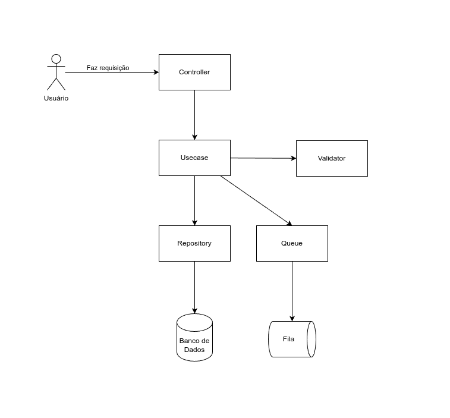
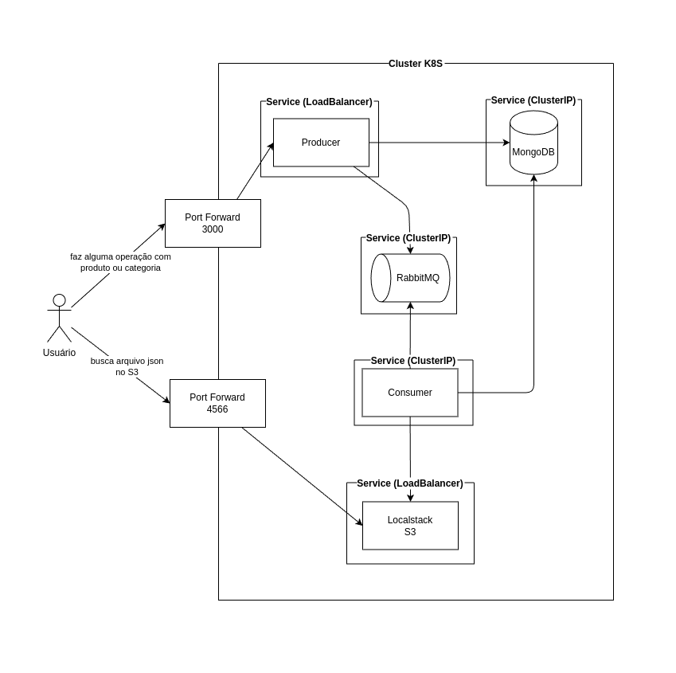
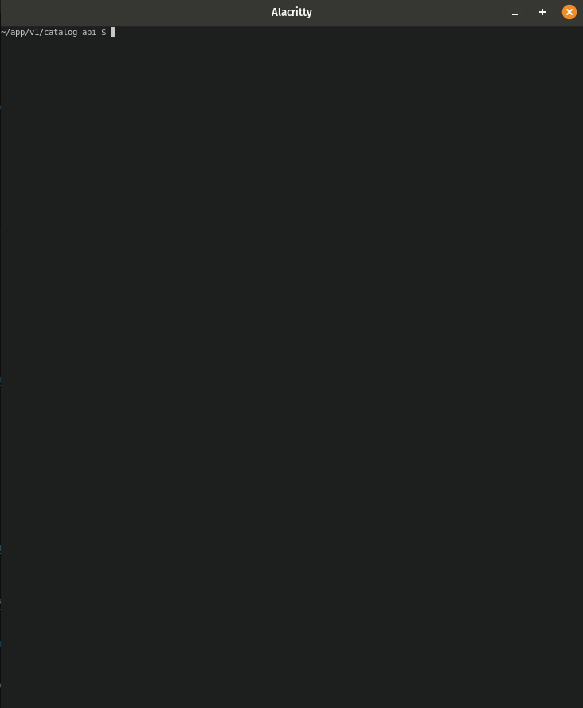
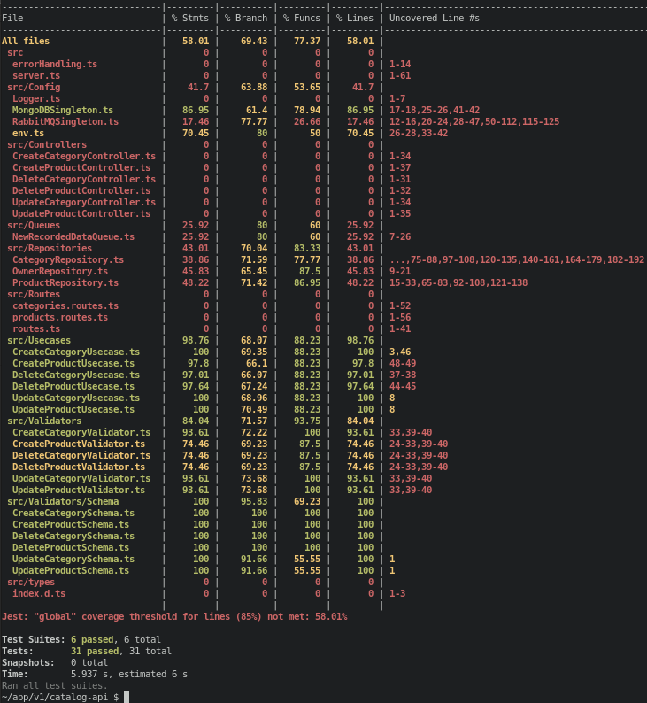
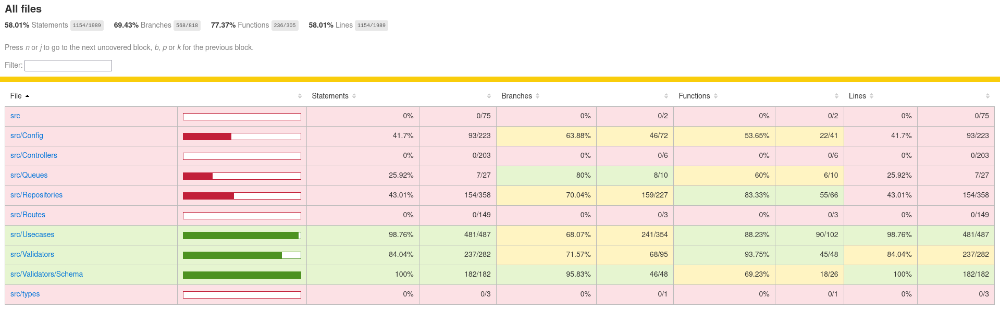
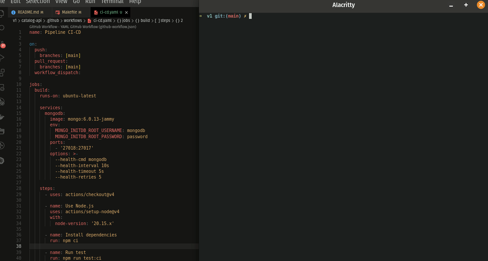

# V1 - Nodejs, RabbitMQ, MongoDB, Act (GitHub Actions)

[Link para ver o vídeo da execução usando o docker compose](https://www.youtube.com/watch?v=1wTzJHnSl2M)

[Link para ver o vídeo da execução usando o kubernetes](https://www.youtube.com/watch?v=xRRKmhuxGw8)

O sistema consiste em cadastrar no banco de dados os produtos, categorias e associar um dono (owner) a eles, e enviar uma mensagem para a fila contendo o id do owner. Um consumer vai buscar a mensagem na fila, em seguida buscar os produtos e categorias associadas ao owner no banco de dados, compila essas informações (como um catalogo) em JSON e criar um arquivo na AWS S3.

## Sumário

- [Práticas de código que foi usado](#práticas-de-código-que-foi-usado)
- [Como é a arquitetura?](#como-é-a-arquitetura)
    - [Desenho da arquitetura no Kubernetes](#desenho-da-arquitetura-no-kubernetes)
    - [C4 Model](#c4-model)
- [Como executar usando o docker compose?](#como-executar-usando-o-docker-compose)
    - [Execução com scripts](#execução-com-scripts)
    - [Execução detalhada](#execução-detalhada)
    - [Execução da cobertura de código](#execução-da-cobertura-de-código)
    - [Execução do teste de performance](#execução-do-teste-de-performance)
    - [Como acessar as GUIs?](#como-acessar-as-guis)
- [Execução da pipeline CI/CD com Act (GitHub Actions)](#execução-da-pipeline-cicd-com-act-github-actions)
- [Como executar usando o kubernetes?](#como-executar-usando-o-kubernetes)
- [Troubleshooting de Docker e Kubernetes](#troubleshooting-de-docker-e-kubernetes)

## Práticas de código que foi usado

- Singleton
- Arquitetura em camadas: Controller, Usecase e Repository.
- SRP: principio da responsabilidade única.
- DIP: principio da injeção de dependências.
- Fail fast: testar primeiro o erro para evitar o uso de if, else e diminuir a identeção.

## Como é a arquitetura?

Código separado em camadas deixa o código mais separado e mais testável.

O código está separado nas camadas:



- Controller: para receber a requisição, devolver o status do response e tratar os erros.
- Usecase: executa a regra de negócio e gerencia o fluxo de execução chamando as outras camadas.
- Validator: valida os dados que a api recebeu na requisição.
- Repository: acesso externo a dados, seja conectando com banco de dados ou API.
- Queue: camada que se comunicar com fila, independente de qual seja a ferramenta.


### Desenho da arquitetura no Kubernetes



### C4 Model


## Como executar usando o docker compose?

[Link para ver o vídeo da execução usando o docker compose](https://www.youtube.com/watch?v=1wTzJHnSl2M)

> Precisa instalar o [terraform](https://developer.hashicorp.com/terraform/install?product_intent=terraform).

1. `git clone https://github.com/deirofelippe/anotaai-challenge.git`
1. `cd ./anotaai-challenge/`

### Execução com scripts

1. `cd ./v1/`
1. `make init-all`: cria rede no docker, inicia o containeres principais e de observabilidade, aplica o Terraform e executa o teste de carga com K6.
1. `make logs-producer`: ver os logs do container do producer.
1. `make logs-consumer`: ver os logs do container do consumer.
1. `make finish-all`: deleta a rede docker e remove os containeres.

### Execução detalhada

1. `cd ./v1/`
1. `docker network create --driver bridge desafio`: 
1. `docker compose -f ./docker-compose-main.yaml up -d --build`: 
1. `docker compose -f ./docker-compose-observability.yaml up -d --build`: 
1. `cd ./terraform`: 
1. `terraform init`: 
1. `terraform apply -auto-approve`: 
1. `cd ../`: 
1. `./k6/k6 run --out json=./k6/metrics.json --out influxdb=http://localhost:8086/k6 ./k6/index.js`: 
1. `docker compose -f ./docker-compose-main.yaml logs -f producer`:
1. `docker compose -f ./docker-compose-main.yaml logs -f consumer`:
1. `docker network rm desafio`: 
1. `docker compose -f ./docker-compose-main.yaml down`: 
    1. Não precisa rodar `terraform destroy -auto-approve`, pois o volume está somente dentro no container.
1. `docker compose -f ./docker-compose-observability.yaml down`: 

### Execução da cobertura de código

1. `cd ./v1/catalog-api`
1. `npm run test:cov`
1. Abra no navegador o arquivo `./coverage/lcov-report/index.html`







### Execução do teste de performance

1. `cd ./v1/`
1. `make k6-run`
1. Abra os logs do producer e do consumer para visualizar o que está sendo feito.

### Como acessar as GUIs?

- Para visualizar o que está no Bucket: `http://localhost:4566/catalog-bucket`
- Para visualizar o que está no Bucket via terminal: `aws --endpoint-url=http://localhost:4566 s3 ls s3://catalog-bucket`

- GUI do RabbitMQ (RabbitMQ Management): `http://localhost:15672/`
- GUI do MongoDB (Mongo Express): `http://localhost:8081/`
- GUI do Prometheus: `http://localhost:9090/`
- GUI do Grafana: `http://localhost:3005/`

## Execução da pipeline CI/CD com Act (GitHub Actions)

1. `cd ./v1/`
1. `make cicd`



## Como executar usando o kubernetes?

[Link para ver o vídeo da execução usando o kubernetes](https://www.youtube.com/watch?v=xRRKmhuxGw8)

> Precista instalar o [helm](https://helm.sh/docs/intro/install/)

1. `kind create cluster --name anotaai`: cria um cluster kubernetes local.
1. `kubectl create namespace anotaai`: cria um namespace para isolar os recursos que serão usados.
1. `helm install prometheus prometheus-community/prometheus --version 25.27.0 --namespace anotaai --set server.service.type=LoadBalancer`: instala o prometheus
    1. `kubectl port-forward service/prometheus-server 3030:80`
1. `helm install grafana grafana/grafana --version 8.5.2 --namespace anotaai --set service.type=LoadBalancer`: instala o prometheus
    1. execute o commando que está saiu no output do helm para pegar a senha do admin, no meu caso o comando é `kubectl get secret --namespace anotaai grafana -o jsonpath="{.data.admin-password}" | base64 --decode ; echo`
    1. `kubectl port-forward service/grafana 3031:80`
1. `kubectl config set-context --current --namespace=anotaai`: configura o namespace criado como padrão, sem precisar informar `--namespace anotaai`.
1. `kubectl apply -f ./k8s`: constroi os recursos (deployments, services, hpa) beaseado nos arquivos de configuração.
1. `kubectl port-forward service/producer 3000:3000`: cria um ponto de acesso local para o pod usando o service.
1. `kubectl port-forward service/localstack 4566:4566`: cria um ponto de acesso local para o pod usando o service.
1. `watch -n 1 "kubectl get pods"`: visualiza o status dos pods.
1. `watch -n 1 "kubectl get hpa producer-hpa"`: visualiza o HPA em uso.
1. `./k6/k6 run --out json=./k6/metrics.json ./k6/index.js`: executa o teste de stress no producer.
1. `kubectl delete all --all`: deleta todos os recursos criados no namespace.

## Troubleshooting de Docker e Kubernetes

A ideia do troubleshooting é o mesmo tanto para o docker como para o kubernetes:

- Verificar as permissões dos arquivos, mudar o owner
    - `ls -lah` lista os arquivos e arquivos ocultos com detalhes de permissões e owners.
    - `chown -R 1000:1000 ./`: modifica o owner e group do arquivo ou pasta.
    - `chmod`: muda as permissões do arquivo se é leitura, escrita, execução e etc.
- Verificar o status do container.
    - `docker container ls -a`
    - `docker compose ps -a`
    - `kubectl get pods`
    - `kubectl get services`
- Ver logs do container.
    - `docker container logs -f aplicacao-backend`
    - `docker compose logs -f aplicacao-backend`
    - `kubectl logs -f pod-backend`
- Acessar o container como root para fazer os testes manuais.
    - `docker container exec -it -u root aplicacao-backend bash`
    - `docker compose exec -u root aplicacao-backend bash`
    - `kubectl exec -it aplicacao-backend -- bash`
        - para acessar como root, o deployment do pod deve ser configurado com o usuário padrão sendo o root
            ```yaml
                # a configuração deve estar dentro do objeto do array "containers"
                # spec.template.spec.containers[0].
                securityContext:
                    allowPrivilegeEscalation: false
                    runAsUser: 0
                # o command vai sobreescrever o command padão e vai forçar o pod a ficar rodando, sem ser finalizado por erro
                command: ["/bin/sleep", "inf"]
            ```
- Verificar se o container/pod consegue se conectar com outro container, se está na mesma rede, se o nome do host está certo, se a porta está configurada.
    - `apt install -y netcat mtr` ou `apk add netcat-openbsd mtr`
    - acesse o container/pod e execute `nc -vz mongodb 27017` para testar se o container/pod tem conexão com o host `mongodb`. Se não tiver, deve ser configurado o host, a porta ou a rede corretamente.
- Verificar se as configurações do container/pod estão certas.
    - `docker container inspect aplicacao-backend` para ver as configurações de Network, Volumes e outros.
    - `kubectl describe pods -l app=aplicacao-backend`: vai listar as configurações dos pods e o `-l` vai selecionar a label configurada no arquivo com o `<key>=<value>` ou no caso `app=aplicacao-backend`.
    - `kubectl describe services -l app=aplicacao-backend`: vai listar as configurações dos services.
